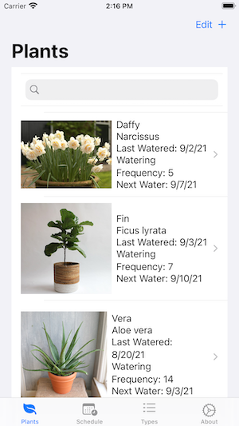
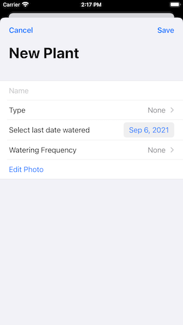

# PlantEd

Need help keeping track of your plant's watering schedule? PlantEd Helps you take care of your plants by reminding you to water them and educating you on your plant!

## Features

+ List of plants to help keep track of them

+ Notifications to remind user to water plant
+ Watering schedule to check what to water in upcoming days

+  List of plants and descriptions of them to learn more about plants

## Actions
+ New plant: Click the top right hand corner's plus button to add a new plant to your list. Fill out the information in the survey.

+ Edit List: Click the edit button in the top right hand corner, then click the red minus button next to the plant you want to delete. Then click delete.

+ Water Your Plant: when you water your plants, make sure to click the watered button to update the app.
+ Plant Education: to learn about different plants, go to the types list tab and scroll thgough the list. To get even more information about a certain plant, click on the plant name, and it will bring you to a page with more information.

## Source code

If you're interested in how PlantEd was writen, check out the source code:

[Source code on GitHub](https://github.com/jacqueraffe/PlantEdCD)